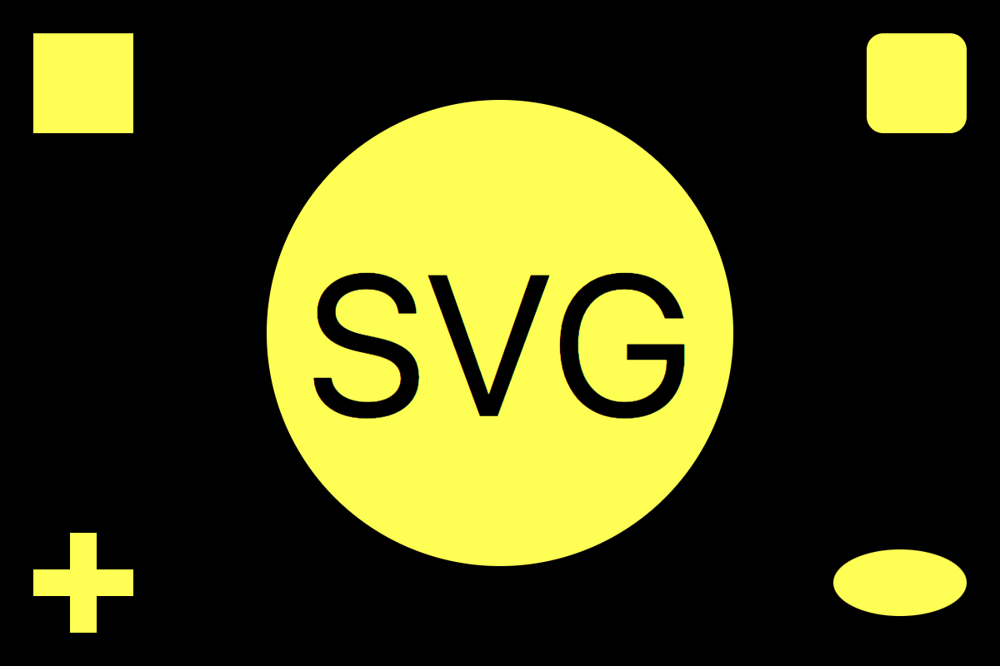
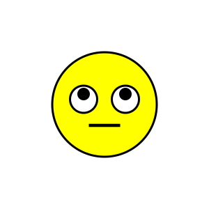
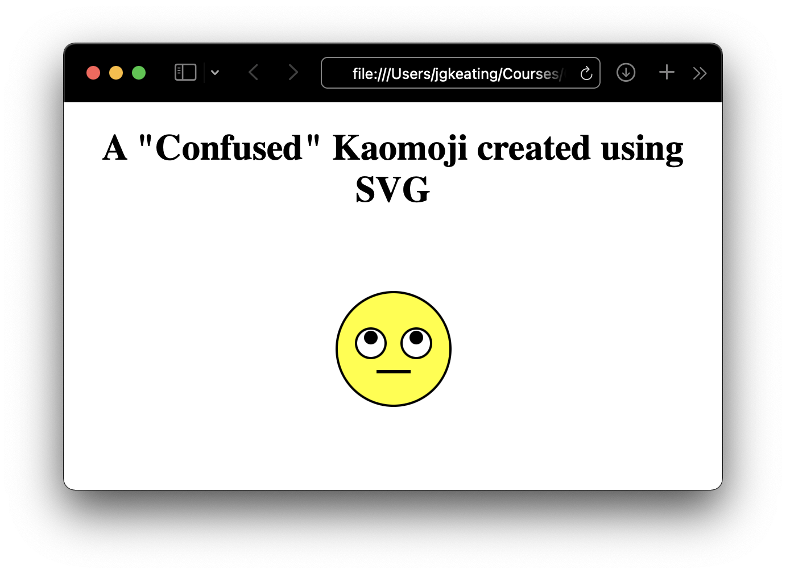
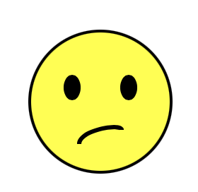
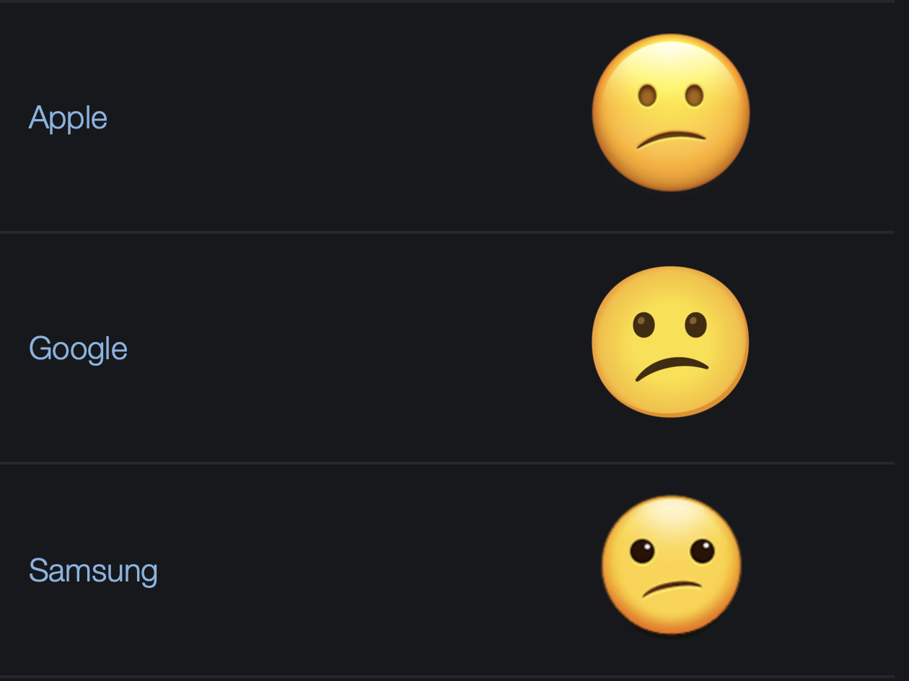

˛
# EU Code Week 2021 - Introductory Coding for Creatives: Using Scalable Vector Graphics (SVGs) to make Emoji and Cartoon Characters

John G Keating
Department of Computer Science
Maynooth University


## Introduction

In this short workshop we will look at how to create and work with SVG (Scalable Vector Graphic) images. If you haven't used SVGs before, then this lesson provided a short overview about what SGVs are, how to create them, and how to use them in online environments. In particular we will learn how to create simple emoticons and cartoon figures (ghosts) using SVG commands.

This workshop (Live Streamed to YouTube; https://youtu.be/_jumZw12Jn4) will introduce participants to the world of vector graphics and explain the basics of creating emoticons (emoji) and simple cartoon characters (ghosts) using Scalable Vector Graphics (SVGs). Participants will first learn how to hand-code using basic and advanced SVG element commands. Once the basics are understood, participants will learn how to animate their creations. Finally, the workshop will end with a short lesson on how to control the graphics and animations using HTML and JavaScript.

John Keating is an Associate Professor in Computer Science at Maynooth University. John has been teaching coding for over 30 years and currently teaches courses on Web Development, Interaction Design, and Software Design. John’s primary research interest is educational technology, collaboration technologies, and technology supported learning. John has doctorates in experimental physics and linguistic methods in science education. All of John's current lecture videos in Software Design and Web Technology are accessible from his YouTube channel (https://www.youtube.com/c/JohnKeatingMU).

## Getting Ready for the Workshop

Participants who have a computer can join in and follow John as he works through the workshop lecture and SVG creation examples. John has provided provide details on how participants can set up their device to make their own SVGs in advance of the workshop; a “Getting ready for the Workshop!” video is available here ( https://youtu.be/jLmNlb_RRAA). Or check the next section on "Tools Required".

All of the example material will be provided via this GitHub repository. Participants do not need internet access to create emoji and cartoons, but they will need internet access to download and install the tools required (the Atom Editor and packages). The “Getting ready for the Workshop!” video will show how to set up everything. If participants have a mobile device with YouTube access they can watch and join in on the live discussion. Teachers may project the YouTube video onto a classroom screen and students can follow on (offline) lab computers, etc. Participation in the chat will require individual access, however.

## Tools Required for the workshop

If you want to code along with John during the workshop you will need to install an editor and an SVG viewer. You will also need a browser that can view SVG images. Specifically, you will need

- The Atom Editor with (sag-preview package installed): (https://atom.io) Atom works for Windows and MacOS and I show how to install it and the SVG preview package. You need to have permission to install applications to use this option.

- Alternatively, you can use an online editor and viewer (https://www.svgviewer.dev). This works well and you will be ablate share your creations easily using this website.


## Scalable Vector Graphics (SVG)

SVG is to graphics what HTML is to text. It is a text-based (XML), open Web standard for defining vector-based images that can be rendered cleanly (scaled/zoomed without loss of quality) at any resolution, and are designed specifically to work well with other web standards such as DOM, CSS, JavaScript, XSL, etc. SVG has been developed by the World Wide Web Consortium (W3C) since 1999. SVG 1.1 became a W3C Recommendation on 16 August 2011.

SVG images and their accompanying behaviours are defined using pure XML text files, which means they can be searched, indexed, scripted, etc. Every element and attribute of the image can be animated. They can be created and edited with any text editor, with drawing software, or created using programs (like we will be doing in this module).

Compared to classic (bitmapped) image formats such as JPEG or PNG, vector images such as SVG can be rendered at any resolution without loss of quality. They can be easily localised,  without the need of a graphical editor, by updating the embedded text using a text editor. With a proper understanding of their construction, and using libraries or custom-written programs, SVG files can be localised interactively.

## Working with SVGs

For this demonstration I will be using the [Atom](https://atom.io) editor to create and display my SVG images. I have installed (i) the [MarkDown Preview Enhanced](https://atom.io/packages/markdown-preview-enhanced) package for my previewing/rendering my markdown (this document), (ii) [SVG Preview](https://atom.io/packages/svg-preview) for viewing SVG files, and (iii) [Atom HTML Preview](https://atom.io/packages/atom-html-preview) for viewing my HTML documents (used to demonstrate how to include SVGs in HTML documents). You can also use [Visual Studio Code](https://code.visualstudio.com), or other editors that allow you to install similar packages. You can, of course, use graphical editors to such as [Inkscape](https://inkscape.org) to create illustrations based on SVGs.

You can also load SVG images using your favourite browser (that supports rendering SVGs!).

As I'm a MacOS user, mostly, I have already installed [Homebrew](https://brew.sh)

```zsh
% /bin/bash -c "$(curl -fsSL https://raw.githubusercontent.com/Homebrew/install/HEAD/install.sh)"
```
which provides all of those additional extras that I need for development. For example, you can use brew it to install the Inkscape application I mentioned earlier.

```zsh
% brew install inkscape
```

This provides me with the GUI-based app and the command line version which is useful for converting between different graphics formats (for example, SVG to PNG, etc.).

## Basic SVG Elements

This section provides a short overview of some of the basic elements of an SVG image. You can use resources, like those in the (Mozilla Developer Network) [MDN Web Docs Reference](https://developer.mozilla.org/en-US/) library or [W3Schools.com](https://www.w3schools.com/), for excellent in-depth tutorials on the technology:

> 1. [MDN (Mozilla Developer Network) Web Docs (SVG)](https://developer.mozilla.org/en-US/docs/Web/SVG/Tutorial)
> 2. [W3Schools (SVG)](https://www.w3schools.com/graphics/svg_intro.asp)

We will being this introduction by examining a straightforward SVG image containing a few basic elements. We will examine the structure, and our understanding of SVG, by making simple modifications to the image. We will discover how to use additional elements later.

Here is an example of a basic SVG image. It is XML, and you can cope and paste it to a file called `basic.svg`, say. You can load this image using your favourite SVG viewer. I'll be using [Atom](https://atom.io).

Note the file contains a single `<svg>` (XML) element which has two important attributes: `version` (which tells the viewer which version of the SVG standard is being used) and the `xmlns`, which tells the view which xml namespace to use (this defines the XML commands). You will see example that do not use these attributes; I like to use them (as I don't like ambiguity) and would encourage you to do likewise. You need to include the `height` and `width` attributes (more on these later) but you can opt to not include the `viewbox` (more on this later) information.

```SVG
<svg version="1.1"
     width="600" height="400"
     viewBox="0 0 300 200"
     xmlns="http://www.w3.org/2000/svg">

     <!-- create a rectangle using the <rect> element-->
     <rect width="100%" height="100%" fill="black" />

     <!-- create a circle using the <circle> element -->
     <circle cx="150" cy="100" r="70" fill="yellow" />

     <!-- write some text using the <text> element -->
     <text x="150" y="125" font-size="60" text-anchor="middle" fill="black">SVG</text>

     <!-- create a rectangle using the <rect> element-->
     <rect x="10" y="10" width="30" height="30" fill="yellow"/>

     <!-- create a rectangle using the <rect> element-->
     <rect x="260" y="10" rx="5" ry="5" width="30" height="30" fill="yellow"/>

     <!-- create two lines using the <line> element-->
     <line x1="25" x2="25" y1="160" y2="190" stroke="yellow" stroke-width="8"/>
     <line x1="10" x2="40" y1="175" y2="175" stroke="yellow" stroke-width="8"/>

     <!-- create a ellipse using the <ellipse> element -->
     <ellipse cx="270" cy="175
       " r="70" rx="20" ry="10" fill="yellow" />

</svg>
```
This SVG code generates the following image when rendered using an SVG viewer.

<center>

</center>

This is an SVG image with physical dimensions specified by a `width` and `height` of `600` and `400` pixels, respectively. It contains a black rectangle which fills the `viewbox` that has the same dimensions as the physical rendering. In the corners, it contains a small yellow rectangle, a rectangle  with rounded corners, a cross and an ellipse. It contains a large yellow circle in the middle of the image with and "SVG" text in black in the centre of the circle.

You can change the `height` and `width` of the SVG element itself; this will change the working dimensions of the image. Remember that they scale anyway as they are vector images. The viewport maps a coordinate system onto the dimensions specified by `height` and `width`. You can control the size of the elements by playing with the viewport (try it yourself).

Basic shape elements such as rectangles, lines, circles, ellipses and text are created using the [`<rect>`](https://developer.mozilla.org/en-US/docs/Web/SVG/Tutorial/Basic_Shapes), [`<line>`](https://developer.mozilla.org/en-US/docs/Web/SVG/Tutorial/Basic_Shapes), [`<circle>`](https://developer.mozilla.org/en-US/docs/Web/SVG/Tutorial/Basic_Shapes), [`<ellipse>`](https://developer.mozilla.org/en-US/docs/Web/SVG/Tutorial/Basic_Shapes) and [`<text>`](https://developer.mozilla.org/en-US/docs/Web/SVG/Tutorial/Basic_Shapes) commands, respectively. There are other basic shapes such as [`<polyline>`](https://developer.mozilla.org/en-US/docs/Web/SVG/Tutorial/Basic_Shapes), [`<polylgon>`](https://developer.mozilla.org/en-US/docs/Web/SVG/Tutorial/Basic_Shapes), and [`<path>`](https://developer.mozilla.org/en-US/docs/Web/SVG/Tutorial/Basic_Shapes).

All of these basic shape elements are `<xml>` tags (elements) that have attributes specifying the features of the element. These include positional and shape information, together with styling such as stroke (line) colour, fill colour (where appropriate), stroke colour and type (solid, dashes, etc.).

Please consult one of the SVG guides, shown above, for details on the elements and their attributes. The [`<rect>`](https://developer.mozilla.org/en-US/docs/Web/SVG/Tutorial/Basic_Shapes) element, however, uses the following six attributes to draw a rectangle. Note in the example above, does not contain values for `x`, `y`, `rx` and `ry` so these attributes (parameters) default to `0`. The main attributes are shown in the table below.

**`<rect>` Element**
| Attribute | Description|
| - |- |
| `x`      | x coordinate of the `<rect>` (top left) |
| `y`      | y coordinate of the `<rect>` (top left) |
| `width`  | width of the `<rect>` |
| `height` | height of the `<rect>` |
| `rx`     | horizontal corner radius of the `<rect>`. Defaults to `ry` if it is specified |
| `ry`     | vertical corner radius of the `<rect>`. Defaults to `rx` if it is specified |


All of these attributes are *animatable*; we will see an example of this later. These attributes' values may be set to a length or percentage value.

As mentioned earlier, it is possible to (downgrade) convert this SVG image to PNG using Inkscape (notice that the aspect ratio is preserved):

```zsh
% /Applications/Inkscape.app/Contents/MacOS/inkscape --export-type png --export-filename basic-inkscape.png -w 600 basic.svg

Background RRGGBBAA: ffffff00
Area 0:0:600:400 exported to 600 x 400 pixels (96 dpi)
%
```
You can now zoom the PNG (bitmap) and SVG (vector) images and see how the quality is retained with the latter.


## EXAMPLE: Creating basic SVG Emoticon Images

In this section wee will discover how to create a simple SVG image which has been created with circles and a single horizontal line; an Emoticon (emotion icon, emote, emoji). We will see how to create different emoji later using more sophisticated SVG elements.

The first example is an Eastern-style "Confused" emoticon  originally that originated in Japan. It's also referred to as a kaomoji (literally "face characters") in Japanese, and written in latin-form as (°°). Note that it differs slightly from the Western-style emoticon for confused (nonplused, puzzles, :S) which we will see later. I've chosen the kaomoji for this example because the set of facial elements can be made using basic elements.

```SVG
<svg xmlns="http://www.w3.org/2000/svg" version="1.1" width="200" height="200">
   <!-- Draw a Yellow Circle with a Black Circumference -->
   <circle cx="100" cy="100" r="50" stroke="black" stroke-width="2" fill="yellow" />

   <!-- Draw a White Circle with a Black Background and a Black Dot -->
   <circle cx="80" cy="95" r="13" stroke="black" stroke-width="2" fill="white" />
   <circle cx="80" cy="90" r="5" stroke="black" stroke-width="2" fill="black" />

   <!-- Draw a White Circle with a Black Background and a Black Dot -->
   <circle cx="120" cy="95" r="13" stroke="black" stroke-width="2" fill="white" />
   <circle cx="120" cy="90" r="5" stroke="black" stroke-width="2" fill="black" />

   <!-- Draw a Black Horizontal Line -->
   <line x1="85" y1="120" x2="115" y2="120" style="stroke:rgb(0,0,0); stroke-width:3" />

   <!-- Message to display if SVG not supported by Graphics Renderer -->
   Sorry, this browser does not support inline SVG.
</svg>
```
This rendered image displays as

<center>

</center>

Note that Markdown (here) does not display SVG images (I've had to convert the SVG to PNG format for display inline here). You can include the code above in an HTML document and then load it with your favourite browser (that supports SVG). For example, if you load the following HTML file using Safari (or other browser)

```HTML
<!DOCTYPE html>
<html>
<body>

<center>

<h1>A "Confused" Kaomoji created using SVG </h1>

<svg xmlns="http://www.w3.org/2000/svg" version="1.1" width="200" height="200">
   <!-- Draw a Yellow Circle with a Black Circumference -->
   <circle cx="100" cy="100" r="50" stroke="black" stroke-width="2" fill="yellow" />

   <!-- Draw a White Circle with a Black Background and a Black Dot -->
   <circle cx="80" cy="95" r="13" stroke="black" stroke-width="2" fill="white" />
   <circle cx="80" cy="90" r="5" stroke="black" stroke-width="2" fill="black" />

   <!-- Draw a White Circle with a Black Background and a Black Dot -->
   <circle cx="120" cy="95" r="13" stroke="black" stroke-width="2" fill="white" />
   <circle cx="120" cy="90" r="5" stroke="black" stroke-width="2" fill="black" />

   <!-- Draw a Black Horizontal Line -->
   <line x1="85" y1="120" x2="115" y2="120" style="stroke:rgb(0,0,0); stroke-width:3" />

   <!-- Message to display if SVG not supported by Graphics Renderer -->
   Sorry, this browser does not support inline SVG.
</svg>
</center>
</body>
</html>
```
It will display the following:

<center>

</center>

Of course, you  can just load the HTML file into Atom and use the HTML previewer to view the file also. The previewers are useful as they give a live update as you change the HTML or SVG code.

## EXAMPLE: Animating our "Confused" Kaomoji

SVGs can include animations so let's examine how we might implement an animation into our "Confused" kaomoji. The animation will be constantly moving the eyeball pupils from the upper part of the eyeball to the centre, and back again.

In practice this means adding a nested `<animate>` element to the `<circle>` elements used to create the pupils, as shown here:

```svg
<circle cx="80" cy="90" r="5" stroke="black" stroke-width="2" fill="black">
   <animate id="one" attributeName="cy" attributeType="XML"
          from="90"  to="95"
          begin="0s;two.end" dur="2s" />
   <animate id="two" attributeName="cy" attributeType="XML"
          from="95"  to="90"
          begin="one.end" dur="2s" />
 </circle>

 <circle cx="120" cy="90" r="5" stroke="black" stroke-width="2" fill="black">
    <animate id="one" attributeName="cy" attributeType="XML"
           from="90"  to="95"
           begin="0s; two.end" dur="2s" />
    <animate id="two" attributeName="cy" attributeType="XML"
           from="95"  to="90"
           begin="one.end" dur="2s" />
 </circle>
```

The animations simply vary the `cy` attribute from (the original) position `90` to new position `95` and back again over a four second interval; two seconds to move the pupil down, and two seconds to move it back up again. You can see from the code that this involves two `<animate>` elements. The first animation (`<animate>` element with `id="one"`) moves the circle to `cy` position `95`. The second animation (`<animate>` element with `id="two"`) moves the circle back to `cy` position `95`. The `cy` is selected using the `<animate>` element's `attributeName` attribute, and the `to` and `from` attributes specify the value range. The `begin` attribute determines when the animations starts, and the `dur` attribute gives the duration of the animation. Notice that we chain the animations using the `begin` attribute - here we start with animation `"one"` and then begin animation `"two"` when animation `"one"` ends, and then restart animation `"one"` when `"two"` ends, and so forth.

Note also that the `<animate>` elements are placed inside the `<circle> .. </circle>` XML tags; in the earlier examples we used the `<circle />` form of the XML tag for the element.

Markdown documents cannot display the SVG animations so you will need to load the following file using a browser, or with Atom (an the previewers) to see it in action.

```HTML
<!DOCTYPE html>
<html>
<body>

<center>

<h1>An Animated "Confused" Kaomoji created using SVG </h1>

<svg xmlns="http://www.w3.org/2000/svg" version="1.1" width="200" height="200">

   <!-- Draw a Yellow Circle with a Black Circumference -->
   <circle cx="100" cy="100" r="50" stroke="black" stroke-width="2" fill="yellow" />

   <!-- Draw a White Circle with a Black Background and a Black Dot -->
   <circle cx="80" cy="95" r="13" stroke="black" stroke-width="2" fill="white" />
   <circle cx="80" cy="90" r="5" stroke="black" stroke-width="2" fill="black">
      <animate id="one" attributeName="cy" attributeType="XML"
             from="90"  to="95"
             begin="0s;two.end" dur="2s" />
      <animate id="two" attributeName="cy" attributeType="XML"
             from="95"  to="90"
             begin="one.end" dur="2s" />
   </circle>

   <!-- Draw a White Circle with a Black Background and a Black Dot -->
   <circle cx="120" cy="95" r="13" stroke="black" stroke-width="2" fill="white" />
   <circle cx="120" cy="90" r="5" stroke="black" stroke-width="2" fill="black">
      <animate id="one" attributeName="cy" attributeType="XML"
             from="90"  to="95"
             begin="0s; two.end" dur="2s" />
      <animate id="two" attributeName="cy" attributeType="XML"
             from="95"  to="90"
             begin="one.end" dur="2s" />
   </circle>

   <!-- Draw a Black Horizontal Line -->
   <line x1="85" y1="120" x2="115" y2="120" style="stroke:rgb(0,0,0); stroke-width:3" />

   <!-- Message to display if SVG not supported by Graphics Renderer -->
   Sorry, this browser does not support inline SVG.

</svg>
</center>
</body>
</html>
```

## EXAMPLE: A "Confused" Emoji

Now let's examine how to make a Western-style "Confused" emoji. One that looks like the following image:

<center>

</center>

Here we can see that the eyes are ellipses and the mouth has an arched shape. We can create this the mouth effect using the `<path>` element as shown below:

```svg
<svg version="1.1"
     width="200" height="200"
     viewBox="0 0 200 200"
     xmlns="http://www.w3.org/2000/svg">

   <!-- face -->
   <circle cx="100" cy="100" r="50" stroke="black" stroke-width="2" fill="yellow" />

   <!-- eyes -->
   <ellipse cx="80" cy="90" rx="5" ry="8" stroke="black" stroke-width="2" fill="black" />
   <ellipse cx="120" cy="90" rx="5" ry="8" stroke="black" stroke-width="2" fill="black" />

   <!-- mouth -->
   <path d="M 85 130 C 85 120, 115 115, 115 120"
         style="stroke:rgb(0,0,0);stroke-width:3"
         fill="transparent"/>

   <!-- Message to display if SVG not supported by Graphics Renderer -->
   Sorry, this browser does not support inline SVG.

</svg>
```
The `<path>` element is one of the  most powerful basic elements. It is used to create curves, lines, arcs, etc. The element makes shapes by combining straight or curved lines. `<path>` take a single attribute `d` which defines the path. In the example we `move (M)` to point `85, 130`, then we draw (using command `C`) a Cubic Bézier curve (using two control points) between the starting point and the end point `115 120`. MDN have an excellent discussion on creating curves using the `<path>` element; you can read about it [here](https://developer.mozilla.org/en-US/docs/Web/SVG/Tutorial/Paths#bézier_curves). We won't go into the detail here as I want to keep this introduction fairly brief.

I think [this](https://css-tricks.com/svg-path-syntax-illustrated-guide/) article by Chris Coyier (2021) on CSS Tricks, providing an illustrated guide on SVG Path is a fantastic read. It explains all of the commands and includes excellent illustrations to accompany examples.

## EXAMPLE: A "Confused" Emoji using Filter Effects

If you consider any Emoji, you will find that different apps render them differently; they have a kind of branding. You can check the [Emojipedia](https://emojipedia.org/) website to learn about the different Emoji and how they are rendered. The "Confused" emoji page is [here](https://emojipedia.org/confused-face/). Here are the renderings from Apple, Google and Samsung; (c) [Emojipedia](https://emojipedia.org/):

<center>

</center>

You will immediately notice that they are richer and have an appearance of "depth". This is because the designers have applied gradients and filters to the various elements.

Here is an example of an updated Western-style "Confused" emoji. The gradients need to be tweaked to make the emoji look better but you could try this yourself to practice. I have not used any filters, just some simple linear gradients on the various elements.

<center>

</center>

For this emoji, the gradients are defined inside a `<defs>` element using the `<linearGradient>` and `<radialGradient>` elements and are each given an `id`. I have created gradients for the emoji, the eyes and mouth. You can change the gradient for the emoji face to see the difference between the linear and radial gradients.


```svg
<svg version="1.1"
     width="200" height="200"
     viewBox="0 0 200 200"
     xmlns="http://www.w3.org/2000/svg">

   <defs>
     <!-- some linear gradients -->
     <linearGradient id="emojiLinearGradient" gradientTransform="rotate(90)">
       <stop offset="5%"  stop-color="yellow" />
       <stop offset="90%" stop-color="gold" />
     </linearGradient>
     <linearGradient id="eyeGradient" gradientTransform="rotate(90)">
       <stop offset="10%"  stop-color="brown" />
       <stop offset="90%" stop-color="black" />
     </linearGradient>,
     <linearGradient id="mouthGradient" gradientTransform="rotate(90)">
       <stop offset="10%"  stop-color="brown" />
       <stop offset="90%" stop-color="black" />
     </linearGradient>
     <!-- Radial Gradient -->
     <radialGradient id="emojiRadialGradient" cx="50%" cy="50%" r="50%" fx="50%" fy="50%">
       <stop offset="0%" style="stop-color:yellow;" />
       <stop offset="100%" style="stop-color:gold;" />
     </radialGradient>
   </defs>

   <!-- Draw a (mostly) Yellow Circle with a Black Circumference and a Gradient -->
   <circle cx="100" cy="100" r="50" stroke="black" stroke-width="2" fill="url('#emojiRadialGradient')" />
   <ellipse cx="80" cy="90" rx="5" ry="8" stroke="black" stroke-width="1" fill="url('#eyeGradient')" />
   <ellipse cx="120" cy="90" rx="5" ry="8" stroke="black" stroke-width="1" fill="url('#eyeGradient')" />

   <path d="M 85 130 C 85 120, 115 115, 115 120"
         style="stroke:rgb(0,0,0);stroke-width:3"
         fill="url('#mouthGradient')"/>

   <!-- Message to display if SVG not supported by Graphics Renderer -->
   Sorry, this browser does not support inline SVG.

</svg>
```
I would recommend reading some more in-depth articles on SVG if you wish to become more expert, for example, this [Smashing Magazine (2019) article](https://www.smashingmagazine.com/2019/05/svg-design-tools-practical-guide/) provides a practical guide to SVG and Design Tools. It's always a good idea to look for different resources on the same topic as you may find one writing style, approach, examples, etc. are more suited to you. Don't dismiss a topic because the first article you read is hard going, or doesn't answer your questions. Keep researching!

For example, if you were interested in designing more emoji, you could think about how to introduce brows, or different features. The following `<path>` elements can be used to add brows to the previously use emojis.

```svg
<path d="M 70 80 C 70 75, 90 75, 90 80"
      style="stroke:rgb(0,0,0);stroke-width:2"
      fill="transparent"/>

<path d="M 110 80 C 110 75, 130 75, 130 80"
      style="stroke:rgb(0,0,0);stroke-width:2"
      fill="transparent"/>
```

Try adding these yourself; and perhaps think about how you might create new features using the basic SVG elements.


## EXAMPLE: Interacting with a "Confused" Emoji using JavaScript

This final example builds on your existing web development knowledge. It uses Javascript to manipulate some of the attribute of an SVG. This powerful facility allows you to build interactive images using SVG. Here is a very straightforward HTML/JavaScript example that allows you to interact with one of the previously discussed examples:

```HTML
<!DOCTYPE html>
<html>
<body>

<center>

<h1>A "Confused" Emoji created using SVG </h1>

<svg id ="emoji" version="1.1"
     width="200" height="200"
     viewBox="0 0 200 200"
     xmlns="http://www.w3.org/2000/svg">

   <!-- face -->
   <circle id="face" cx="100" cy="100" r="50" stroke="black" stroke-width="2" fill="yellow" />

   <!-- eyes -->
   <ellipse cx="80" cy="90" rx="5" ry="8" stroke="black" stroke-width="2" fill="black" />
   <ellipse cx="120" cy="90" rx="5" ry="8" stroke="black" stroke-width="2" fill="black" />

   <!-- mouth -->
   <path d="M 85 130 C 85 120, 115 115, 115 120"
         style="stroke:rgb(0,0,0);stroke-width:3"
         fill="transparent"/>

   <!-- Message to display if SVG not supported by Graphics Renderer -->
   Sorry, this browser does not support inline SVG.

</svg>

<script>
    function updateEmojiPink() {
        document.getElementById("face").setAttribute("fill", "Magenta");
    }
    function updateEmojiYellow() {
        document.getElementById("face").setAttribute("fill", "Yellow");
    }
    function updateEmojiSmaller() {
        document.getElementById("emoji").setAttribute("width", "100");
        document.getElementById("emoji").setAttribute("height", "100");
    }
    function updateEmojiBigger() {
        document.getElementById("emoji").setAttribute("width", "200");
        document.getElementById("emoji").setAttribute("height", "200");
    }
</script>

<br />

<input id="svgButton" type="button" value="Pink!" onclick="updateEmojiPink()"/>
<input id="svgButton" type="button" value="-" onclick="updateEmojiSmaller()"/>
<input id="svgButton" type="button" value="+" onclick="updateEmojiBigger()"/>
<input id="svgButton" type="button" value="Yellow!" onclick="updateEmojiYellow()"/>

</center>
</body>
</html>
```

As you can see from the code above, manipulation of the SVG hinges on first obtaining a reference to the DOM element, specified by an `id`, for example, `id="emoji"` for the SVG element itself, and `id="face"` for the circle representing the face. You can obtain a reference to the SVG itself, or the element, using `document.getElementById()`. Once you have these references you can change their attributes using `setAttribute()`.

You can obtain the value of an attribute using the `getAttribute()` function (as you may want to manipulate the current value). You can change the style of an element via the `style` property; for example, you could change the stroke width of an element in the SVG using `element.style['stroke-width']=1`.

You can also add event listeners to the SVG. Try replacing the `<ellipse>` elements in the example above with:

```svg
<ellipse cx="120" cy="90" rx="5" ry="8" stroke="black" stroke-width="2" fill="black"
   onmouseover="this.style.fill = 'red'; this.style.stroke = 'red'; this.style['stroke-width'] = 5;"
   onmouseout="this.style.fill = 'black'; this.style.stroke = 'black'; this.style['stroke-width'] = 2;"
/>
```

This provides you with hover functionality using the `onmouseover` and `onmouseout` event listeners. You could also try adding the following to the example ... for fun!

```HTML
<br />

<script>
var faceSlider = function(slider, direction) {
    var value = slider.value;
    var face = document.getElementById("face");
    var coord = "c" + direction;
    face.setAttributeNS(null, coord, value * 3);
}
</script>

<br />

<span style="font-family:sans-serif">cx:</span> <input type="range" min="20" max="40" value="30" oninput="faceSlider(this, 'x')"/>
<span style="font-family:sans-serif">cy:</span> <input type="range" min="20" max="40" value="30" oninput="faceSlider(this, 'y')"/>

```

You can implement all sorts of effects using JavaScript. Conduct some research and play with the sample files to see what is possible. You could try, for example, animate using JavaScript rather than using the SVG `<animate>` element.

If you are interested in using SVG in your web applications, I would recommend using an SVG library like [D3.js](https://d3js.org) - it's a wonderful resource for bringing data to life using HTML, SVG and CSS.


## Summary

We learned about creating, manipulating and interacting with SVGs (Scalable Vector Graphics).
